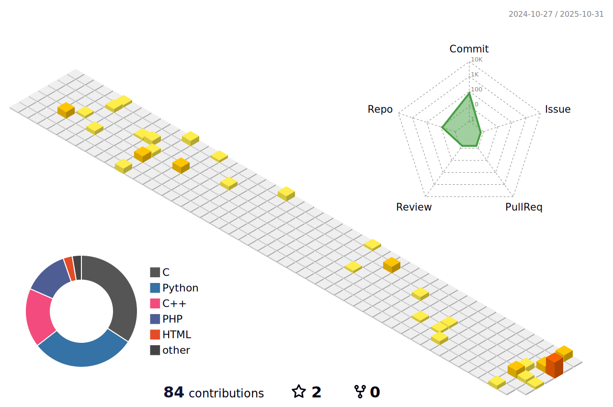
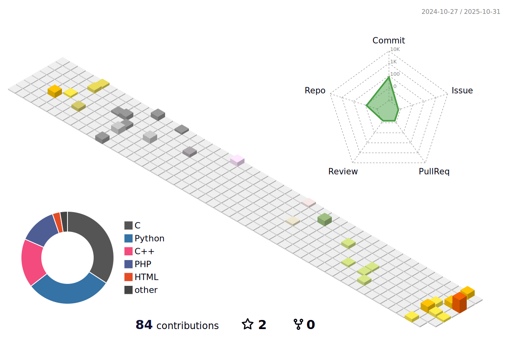
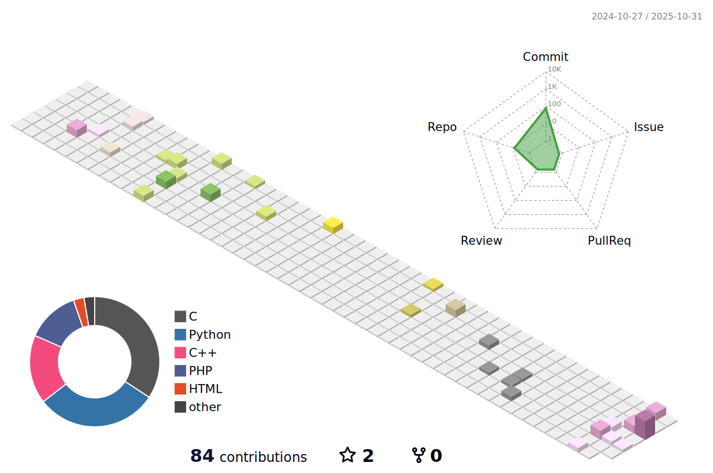
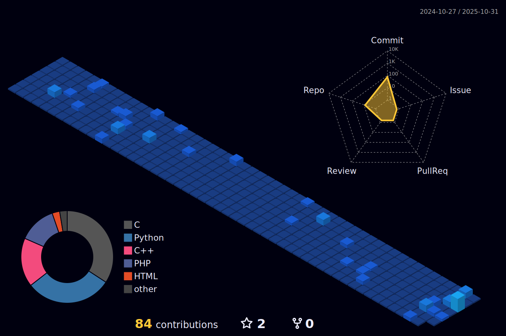
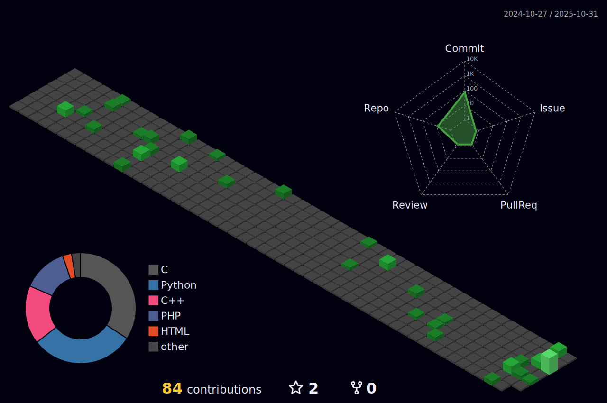
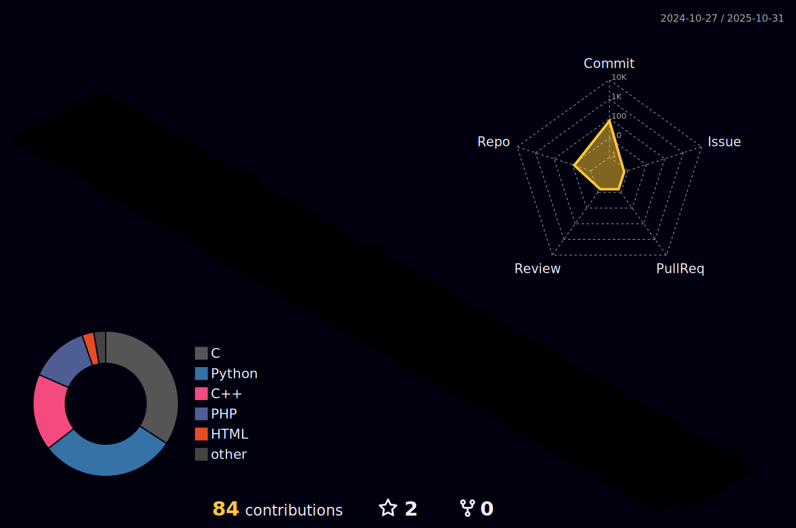
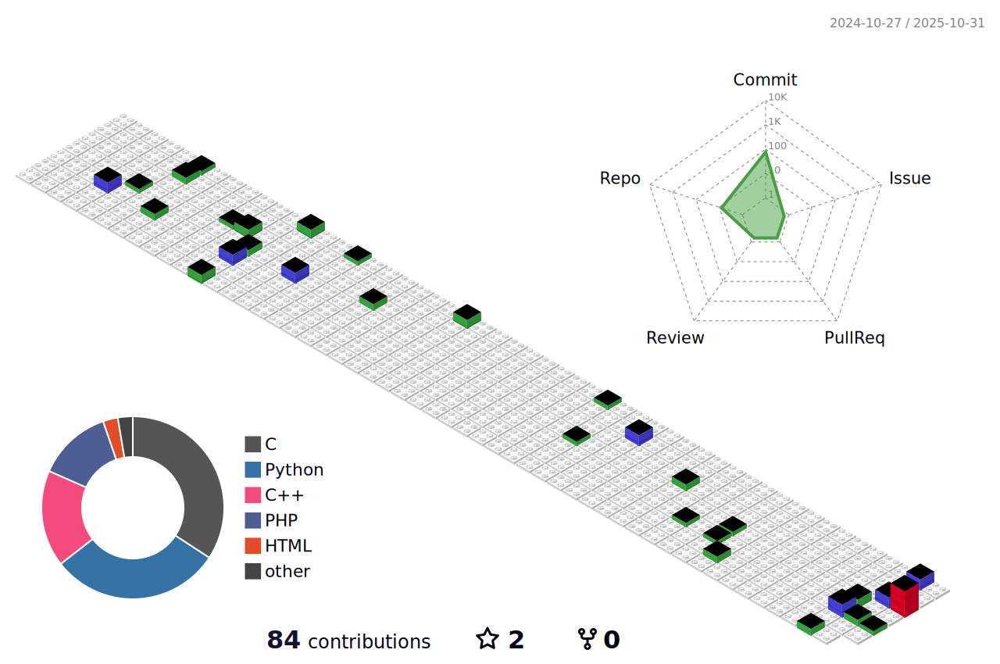

<!---->

<!--

-->
<!--

-->

<!--

-->

<!--

-->

<!-- 従来

-->

<!---->
<!---->
<!---->
<!---->
<!---->
<!---->
<!---->
<!---->
<!---->

<!---->

<!--Chiba Institute of Technology > Faculty of Advanced Engineering > Department of Advanced Robotics > Bachelor 2-->

<!--
- 🔭 I’m currently working on ...
- 🌱 I’m currently learning ...
- 👯 I’m looking to collaborate on ...
- 🤔 I’m looking for help with ...
- 💬 Ask me about ...
- 📫 How to reach me: ...
- 😄 Pronouns: ...
- ⚡ Fun fact: ...
-->
